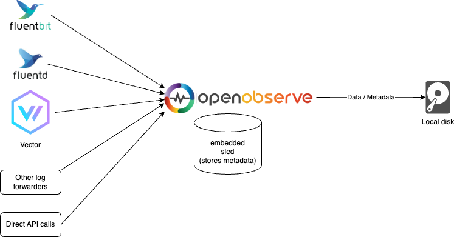
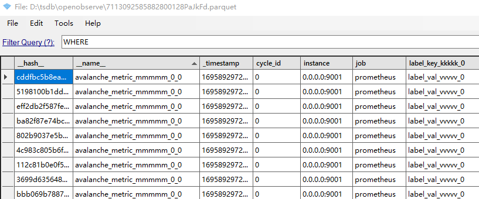
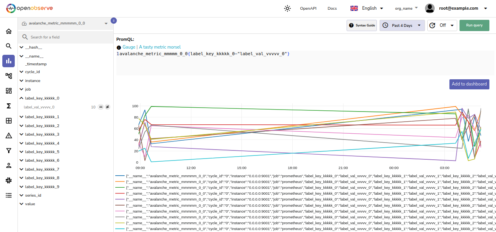

openobserve是一套开源的可观测数据融合处理平台。通过不同的api接口，支持metrics、log、trace等数据的持久化。本文尝试探究一下openobserve的运行原理。
# 1、安装
官方给了2种典型的安装方式，包括单机模式和HA高可用模式。详细可参考https://openobserve.ai/docs/quickstart/
## 1.1 单机模式

运行很简单，携带用户名和密码，启动即可。
```
ZO_ROOT_USER_EMAIL="root@example.com" ZO_ROOT_USER_PASSWORD="Complexpass#123" ./openobserve
```

## 1.2 HA模式

跟Cortex/Thanos等数据持久化解决方案类似，openobserve的高可用模式也包括多个功能组件，包括ingester、compactor、querier、alert。特别之处在于，etcd
存放series的schema信息，S3存放数据的parquet文件。
在k8s集群中，参考官方指引部署即可：
```
helm repo add openobserve https://charts.openobserve.ai
helm repo update

kubectl create ns openobserve

helm --namespace openobserve -f values.yaml install zo1 openobserve/openobserve

#暴露前端页面
kubectl --namespace openobserve port-forward svc/zo1-openobserve-router 5080:5080
```
本例使用到的 values.yaml 可以参考github链接。
```
helm --namespace openobserve -f values.yaml install zo1 openobserve/openobserve

replicaCount: Not a table.
NAME: zo1
LAST DEPLOYED: Wed Sep 27 12:22:05 2023
NAMESPACE: openobserve
STATUS: deployed
REVISION: 1
TEST SUITE: None


Forwarding from 127.0.0.1:5080 -> 5080
Forwarding from [::1]:5080 -> 5080
```

# 2、数据注入
## 2.1 metrics 写入
接口调用
```
POST /api/{organization}/prometheus/api/v1/write
```
数据写入支持 OTEL collector 和 Prometheus 等方式。本文以 Prometheus 数据导入为例。
参考Prometheus 的 remote write 配置如下：
```
remote_write:
  - url: "http://127.0.0.1:5080/api/org_name/prometheus/api/v1/write"
    basic_auth:
      username: root@example.com
      password: Complexpass#123
```
## 2.2 log 写入
接口调用
```
POST /api/{organization}/{stream}/_json
```
在vector、Filebeat、Syslog、Curl等多种方式下快捷导入日志信息。
## 2.3 trace 写入
接口调用
```
POST /api/{organization}/traces
```
支持 opentelemetry SDK 的原生格式，导入trace数据，包括但不限于Go、Python、Java等语言。

# 3、数据流转
在twitter上咨询 OpenObserve 时，分享了两点信息：
```
1. OpenObserve stores files temporarily as json before being converted to parquet files. All series pertaining to a single metric are stored together.
2. sled/etcd eventually stores metadata in physical files, but OpenObserve never stores data directly to files. Only through sled/etcd.
```
所以，OpenObserve 不再像 Prometheus 一样，去维护 index/tsdb 信息，而是交由第三方工具，来进行meta信息，以及落盘文件的格式管理。下面我们以metrics 的写入和查询，来了解一下这个过程。
## 3.1 数据写入
数据写入，以逻辑日志的形式，将原始series信息记录到wal (json格式)文件，随后周期到达后，会将此json批量转储成parquet文件，上传到S3。
包括记录meta信息、数据写入json文件。

### 将series的schema信息存储到etcd
代码入口：
```
D:\opensource\openobserve\src\service\metrics\prom.rs
remote_write
        set_schema_metadata(org_id, &metric_name, StreamType::Metrics, extra_metadata)
            .await
            .unwrap();
```
可以在etcd中查询到series的schema信息，schema只记录series的lable-key，metrics name等信息。
```
#etcd查看所有的key
etcdctl get /  --prefix --keys-only 
/zinc/observe/schema/org_name/metrics/avalanche_metric_mmmmm_0_0
...
# etcd查看avalanche_metric_mmmmm_0_0的schema信息
etcdctl get   --prefix /zinc/observe/schema/org_name/metrics/avalanche_metric_mmmmm_0_0

[{"fields":[],"metadata":{"start_dt":"1695868345620467","prom_metadata":"{\"metric_type\":\"Gauge\",\"metric_family_name\":\"avalanche_metric_mmmmm_0_0\",\"help\":\"A tasty metric morsel\",\"unit\":\"\"}","created_at":"1695868345620467","end_dt":"1695868297371000"}},
{"fields":[
  {"name":"__hash__","data_type":"Utf8","nullable":true,
"dict_id":0,"dict_is_ordered":false,"metadata":{}},
  {"name":"__name__","data_type":"Utf8","nullable":true,"dict_id":0,"dict_is_ordered":false,"metadata":{}},
  {"name":"_timestamp","data_type":"Int64","nullable":true,"dict_id":0,"dict_is_ordered":false,"metadata":{}},

```

###  series 数据写入wal
代码入口：
```
D:\opensource\openobserve\src\common\infra\wal.rs

pub fn write_file(
let file = get_or_create(

impl RwFile {
let file_name = format!("{thread_id}_{key}_{id}{}", FILE_EXT_JSON);
```
通过上述流程，生成如下wal文件

json文件内容，和下文的parquet文件，在内容上一致。

### 转成parquet格式并上传到S3
周期到达后，会将wal文件(如果记录在内存，则从内存中提取逻辑日志信息）组装成 parquet 文件。关于 parquet 如何进行嵌套数据存储（更适合trace数据存储），可以参考相关 https://github.com/apache/parquet-format 和 https://blog.csdn.net/Night_ZW/article/details/108359619 更深入了解。
代码入口：
```
D:\opensource\openobserve\src\job\files\memory.rs
D:\opensource\openobserve\src\job\files\disk.rs
move_files_to_storage

```
可以周期性的看到 ingester 有如下上传信息：
```
[2023-10-03T02:06:58Z INFO  openobserve::job::files::disk] [JOB] convert disk file: data/wal/files/org_name/metrics/up/0_2023_09_28_00_keeping_7113098315302051840hFwd3b.json
[2023-10-03T02:06:58Z INFO  openobserve::job::files::disk] [JOB] File upload begin: disk: data/wal/files/org_name/metrics/up/0_2023_09_28_00_keeping_7113098315302051840hFwd3b.json
[2023-10-03T02:06:58Z INFO  openobserve::service::schema] service:schema:schema_evolution; org_id="org_name" stream_name="up" stream_type=Metrics min_ts=1695894790904000
[2023-10-03T02:06:58Z INFO  openobserve::job::files::disk] [JOB] disk file upload succeeded: files/org_name/metrics/up/2023/09/28/00/7113098315302051840hFwd3b.parquet
```
上传到S3的parquet文件，解析出来如下：


## 3.2 数据查询
在Web触发一次metric查询，avalanche_metric_mmmmm_0_0{label_key_kkkkk_0="label_val_vvvvv_0"}

### Querier 执行查询
Querier侧的入口日志如下：
```
[2023-10-06T08:25:14Z INFO  openobserve::service::promql::search::grpc::storage] promql:search:grpc:storage:create_context; org_id="org_name" stream_name="avalanche_metric_mmmmm_0_0"
[2023-10-06T08:25:14Z INFO  openobserve::service::promql::search::grpc::storage] promql:search:grpc:storage:get_file_list; org_id="org_name" stream_name="avalanche_metric_mmmmm0_0"
[2023-10-06T08:25:14Z INFO  openobserve::service::promql::search::grpc::wal] promql:search:grpc:wal:get_file_list; org_id="org_name" stream_name="avalanche_metric_mmmmm_0_0" time_range=(1696573200343000, 1696580700343000)
[2023-10-06T08:25:14Z INFO  actix_web::middleware::logger] 10.244.0.7 "GET /api/org_name/prometheus/api/v1/query_range?start=1696573500343000&end=1696580700343000&step=0&query=avalanche_metric_mmmmm_0_0%7Blabel_key_kkkkk_0%3D%22label_val_vvvvv_0%22%7D HTTP/1.1" 200 4356 "-" "http://127.0.0.1:5080/web/metrics?stream=avalanche_metric_mmmmm_0_12&period=2h&refresh=0&query=YXZhbGFuY2hlX21ldHJpY19tbW1tbV8wXzEye30=&org_identifier=org_name" "Mozilla/5.0 (X11; Ubuntu; Linux x86_64; rv:109.0) Gecko/20100101 Firefox/116.0" 0.063740
```
代码逻辑流程如下：
```
create_context 
  get_file_list // 获取包含metric的files列表
  cache_parquet_files  // 下载parquet文件
  db::schema::get(org_id, stream_name, stream_type) // 从etcd获取当前metric最新的schema信息
  register_table  // 注册 datafusion 以适配parquet和json的数据查询
```
首先从filelist中找到metric做为stream name的files列表，
```
files内容
{"key":"files/org_name/metrics/avalanche_metric_mmmmm_0_1/2023/09/28/00/71129873952131031049nQPk2.parquet","meta":{"min_ts":1695868297371000,"max_ts":1695868942371000,"records":430,"original_size":274733,"compressed_size":9729},"deleted":false}
```
然后去S3下载这些parquet文件。
由于metric的schema信息可能会发生变化，但频率不高，所以从etcd获取到metric的所有metric label标签后，做为查询索引，去搜索parquet文件和当前wal文件中的内容。
OpenObserve使用datafusion将json和parquet数据一起进行SQL查询，进行metric的过滤。
```
D:\opensource\openobserve\src\service\search\datafusion\exec.rs

    datasource::{
        file_format::{
            file_type::{FileType, GetExt},
            json::JsonFormat,
            parquet::ParquetFormat,
```
可以参考 datafusion 官方文档 https://arrow.apache.org/datafusion/ ，了解查询引擎如何将各类数据，进行SQL分析。
### 其他查询
OpenObserve也提供了series、labels、values等查询接口，可以继续了解。
```
D:\opensource\openobserve\src\handler\http\request\prom\mod.rs
#[get("/{org_id}/prometheus/api/v1/series")]
pub async fn series_get(
    org_id: web::Path<String>,
    req: web::Query<meta::prom::RequestSeries>,
) -> Result<HttpResponse, Error> {
    series(&org_id, req.into_inner()).await
}
D:\opensource\openobserve\src\service\metrics\prom.rs
pub(crate) async fn get_series(
```


