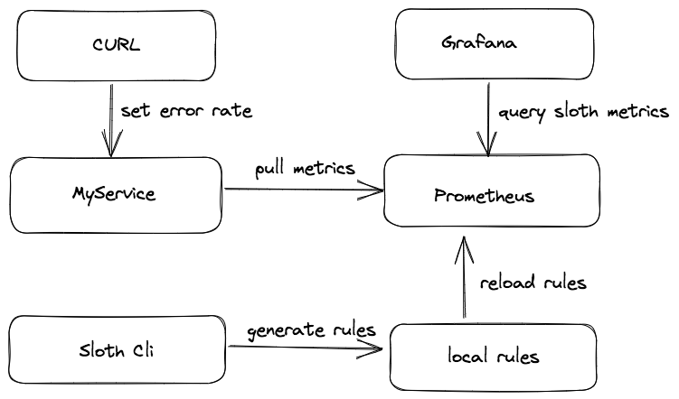
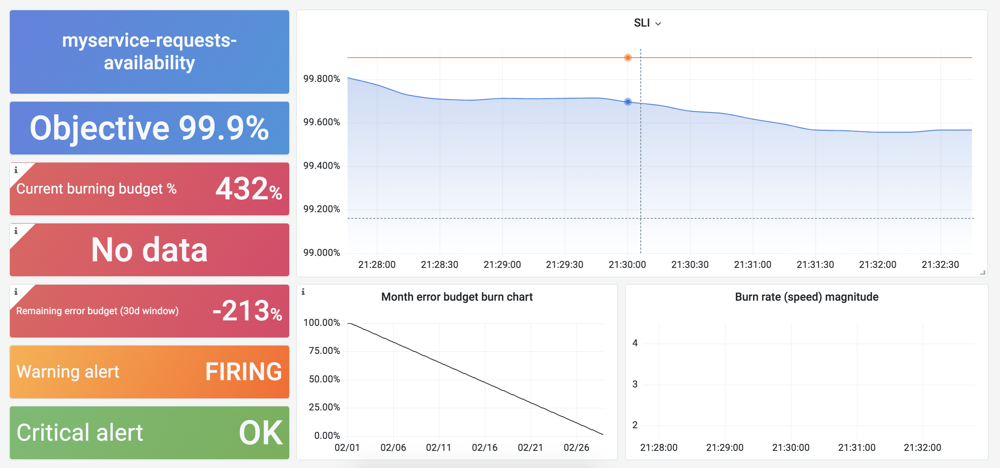

# 基于SLO告警（Part 3）：开源项目 sloth 使用

在系列文章第2篇我们已经知道，基于SLO告警最好采用 MWMR（多窗口多燃烧率）的策略。当我们以 Prometheus 为基础，实现 SLO 告警需注意以下几点：

- 时间窗口、燃烧率、告警级别需要同时考虑。
- 单个 SLO 会同时生成多个 Prometheus record 和 alert 规则。
- 时间窗口、燃烧率、告警级别任一更改需要重新生成告警规则。

大量 Prometheus 规则文件的生成并不容易，那我们该如何准确、高效的生成它们呢？

这就是今天要向大家推荐的一个 Prometheus SLO 生成器 -- sloth（https://github.com/slok/sloth）。

## Sloth 简介

Sloth 是 GitHub 上一个开源的 Prometheus SLO 自动生成器，它采用 MWMR 的策略，支持窗口和多个告警策略的配置，以及SLI 插件来简化 SLO 编写，另外它还打通了 Prometheus-Operator 并提供了开箱即用的 Grafana 模板，实现多服务 SLO 统一可视化。

### SLoth 整体架构


从架构图可知，sloth 统一加载 SLO 配置后，会将其自动转化为 `SLIs`, `Metadata`, `Alerts` 三类 Prometheus 规则：

- `SLIs`: 属于 Prometheus record 类型，它是一切 SLO 计算的基础，根据用户配置的 `events`，自动生成不同时间窗口的指标错误率（例如slo:sli_error:ratio_rate5m，slo:sli_error:ratio_rate30m）。 
- `Metadata`: 属于 Prometheus record 类型，主要用于某个服务 SLO 使用情况统计，如剩余错误预算、SLO 目标百分比，这些指标用于 SLO 可视化非常方便。
- `Alerts`: 属于 Prometheus alert 类型，它依靠生成的 SLIs，集合不同窗口配置参数生成不同级别的告警规则。

### Sloth 支持的 SLO 三种格式

Sloth 一共支持三种不同 SLO 格式，它们分别为默认、K8s、OpenSLO。

1. 默认格式

```

version: "prometheus/v1"
service: "myservice"
labels:
  owner: "myteam"
slos:
  - name: "requests-availability"
    objective: 99.9
    description: "Common SLO based on availability for HTTP request responses."
    sli:
      events:
        error_query: sum(rate(http_request_duration_seconds_count{job="myservice",code=~"(5..|429)"}[{{.window}}]))
        total_query: sum(rate(http_request_duration_seconds_count{job="myservice"}[{{.window}}]))
    alerting:
      ...
```

它是 sloth 自定义的格式，主要包含了服务名称、服务标签和多个 SLos 配置，非 K8S 环境大多采用它。

2. K8s 格式：

```
apiVersion: sloth.slok.dev/v1
kind: PrometheusServiceLevel
metadata:
  name: sloth-slo-my-service
  namespace: monitoring
spec:
  service: "myservice"
  labels:
  owner: "myteam"
  slos:
    - name: "requests-availability"
        objective: 99.9
        description: "Common SLO based on availability for HTTP request responses."
        sli:
        events:
            error_query: sum(rate(http_request_duration_seconds_count{job="myservice",code=~"(5..|429)"}[{{.window}}]))
            total_query: sum(rate(http_request_duration_seconds_count{job="myservice"}[{{.window}}]))
        alerting:
        ...
```

它其实是一个叫做 PrometheusServiceLevel 的 K8s CRD，其 spec 内容与 sloth 默认格式基本一致。

Sloth 不仅支持 CLI 还支持 K8s controller，当它监听到 K8s 集群的 `PrometheusServiceLevel` 资源对象的变更，会自动将其转化为 Prometheus Operator 的  `PrometheusRule` 资源对象，做到 Prometheus Operator 无缝对接。

3. OpenSLO 格式：

```
apiVersion: openslo/v1alpha
kind: SLO
metadata:
  name: sloth-slo-my-service
  displayName: Requests Availability
spec:
  service: my-service
  description: "Common SLO based on availability for HTTP request responses."
  budgetingMethod: Occurrences
  objectives:
    - ratioMetrics:
        good:
          source: prometheus
          queryType: promql
          query: sum(rate(http_request_duration_seconds_count{job="myservice",code!~"(5..|429)"}[{{.window}}]))
        total:
          source: prometheus
          queryType: promql
          query: sum(rate(http_request_duration_seconds_count{job="myservice"}[{{.window}}]))
      target: 0.999
  timeWindows:
    - count: 30
      unit: Day
```

社区为了更好推进 SLO 落地和应用，发起了 OpenSLO 项目，它支持多种数据源（不仅限于 Prometheus），所以 sloth 也对其进行了部分支持。

### 安装和使用

- 二进制安装和使用

```
curl https://github.com/slok/sloth/releases/download/v0.11.0/sloth-linux-amd64 -o sloth
chmod +x sloth
./sloth generate -i slos/myservice.yaml -o rules/myservice.yaml 
```

国内从 github 下载资源较慢，大家可以使用容器进行安装。

- Docker 安装和使用 

```
# 如果 ghcr.io 镜像无法拉取，请使用 ghcr.dockerproxy.com 代理
docker pull ghcr.io/slok/sloth
docker run --rm --name sloth -v=$(pwd):/sloth ghcr.io/slok/sloth generate -i /sloth/slos/myservice.yaml -o /sloth/rules/myservice.yaml 
```

- K8s 安装和使用

```
curl https://raw.githubusercontent.com/slok/sloth/v0.11.0/pkg/kubernetes/gen/crd/sloth.slok.dev_prometheusservicelevels.yaml -o sloth.slok.dev_prometheusservicelevels.yaml
# CRD 安装
kubectl apply -f ./sloth.slok.dev_prometheusservicelevels.yaml
curl https://raw.githubusercontent.com/slok/sloth/main/deploy/kubernetes/raw/sloth.yaml -o sloth.yaml

$ kubectl create ns monitoring
#  运行 sloth controller
$ kubectl apply -f ./deploy/kubernetes/raw/sloth.yaml

# 部署 slo
$ kubectl apply -f ./examples/k8s-getting-started.yml
```

4.  Helm 安装

```
helm repo add sloth https://slok.github.io/sloth
helm repo update
helm template sloth/sloth --include-crds

# 部署 slo
$ kubectl apply -f ./examples/k8s-getting-started.yml
```

## 实战练习

### 示例流程

整个流程如下图：



流程说明：

1. 使用 sloth cli 自动生成 SLO 相关的规则文件。
2. 创建一个叫做 MyService 的 HTTP 服务，该服务通过暴露的接口可以设置不同错误预算消耗率。
3. 部署 Prometheus 收集 MyService 的指标，并加载 sloth 自动生成的 rules 配置文件。
4. Grafana 通过导入 sloth 预设的模版，进行 MyService SLO 的可视化。


### 程序运行及效果

示例程序已提交到 https://github.com/grafanafans/play-with-sloth 仓库，欢迎查看。


#### 启动程序

```

git clone https://github.com/grafanafans/play-with-sloth.git
make generate // 使用 sloth cli 生成 myservice 的 rules
make start 
```

#### Grafana 导入 sloth 看板

使用导入创建的方式新增 slos 相关看板，导入的看板 id 为 14348 和 14643。


#### 设置 MyService 错误率

```
curl http://localhost:8080/errrate?value=0.005
```

当设置错误率为 0.5%（SLO 0.1%的5倍），其看板内容大致为：



## 总结

本文主要讲解如何围绕 sloth 进行 SLO 建设，使用它不仅可以高效的生成大量 Prometheus rules 配置文件，还可以通过开箱即用的统一看板对多个服务的 SLO 进行观测。另外 sloth 提供的 k8s controller 能够无缝与 Prometheus Operator 集成，方便云原生的用户进行使用，感兴趣的小伙伴可以试试。

- 基于 SLO 告警（Part 1）：基础概念
- 基于 SLO 告警（Part 2）：为什么使用 MWMB 方法
- 基于 SLO 告警（Part 3）：开源项目 sloth 使用
- 基于 SLO 告警（Part 4）：开源项目 pyrra 使用
- 基于 SLO 告警（Part 5）：SLO 多租户与服务化